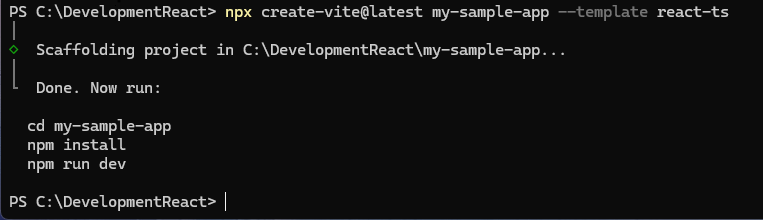
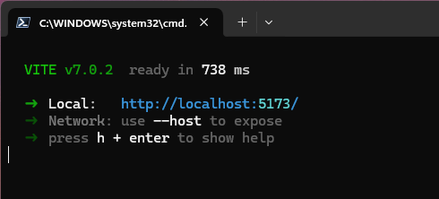
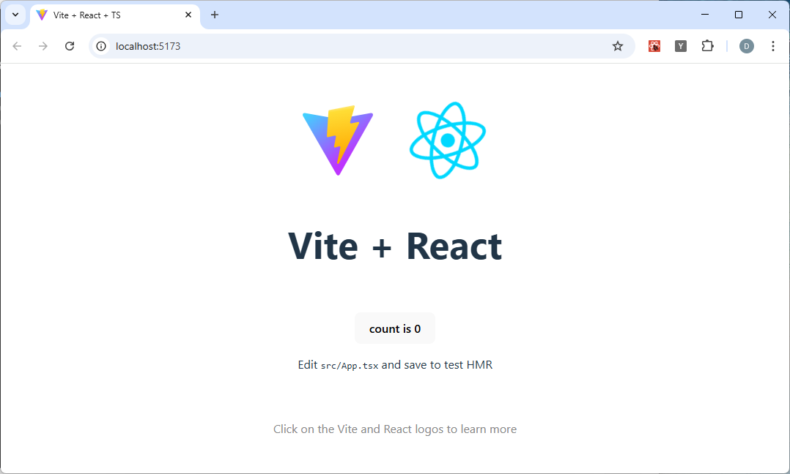

# Create the basic app

```
npx create-vite@latest my-sample-app --template react-ts
```



# Install the NPM Components

```
cd my-sample-app
npm install
```

# Run the application

```
npm run dev
```



