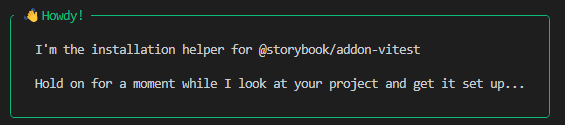

```
npm create storybook@latest
```





```
npm install @storybook/builder-vite --save-dev
```

# Package.Json

The installed has added scripts for storybook

package.json

```json
  "scripts": {
    "dev": "vite",
    "build": "tsc -b && vite build",
    "lint": "eslint .",
    "preview": "vite preview",
    "storybook": "storybook dev -p 6006",
    "build-storybook": "storybook build"
  },
```


`https://storybook.js.org/docs/builders/vite`